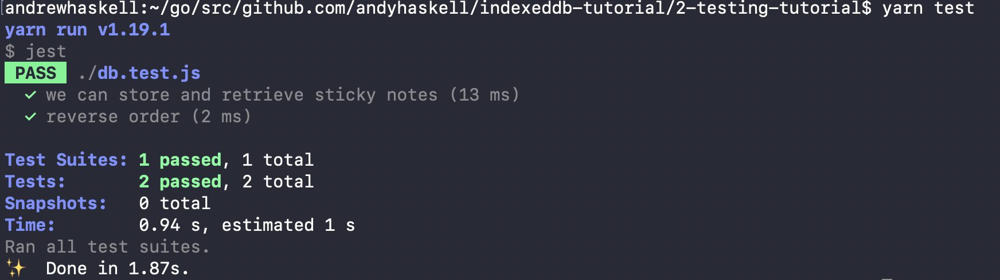

## Test coverage tutorial code

This directory contains the code from [Part 2](https://dev.to/andyhaskell/testing-your-indexeddb-code-with-jest-2o17) of my Build a Basic Web App with IndexedDB tutorial series. In that part, we look at how to give our IndexedDB code test coverage using Jest + fake-indexeddb.

The code is arranged as follows:

* `db.js` contains all database logic, under three major functions:
  * `setupDB`, which creates our IndexedDB database with a `notes` object store.
  * `addStickyNote`, which adds a sticky note with a message to our database.
  * `getNotes`, which retrieves sticky notes, either in forward or reverse order.
* `page.js` contains all DOM manipulation, which is mostly the same as it was in Part 1.
* `db.test.js` contains Jest unit test coverage for the database logic in `db.js`.

To run the automated tests for this sample code, run:

```
yarn install
yarn test
```

and you should see output like this:



To try out the web app with this code, run:

```
yarn install
yarn serve
```

You can then try out the web app at `localhost:1123`.

