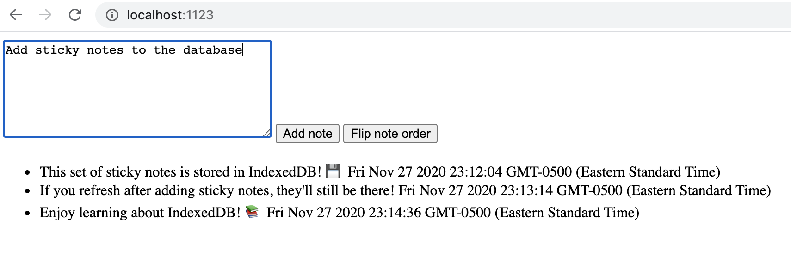

# IndexedDB tutorial example code

This is the code from my IndexedDB tutorial series on dev.to, with the following parts:

* [Part 1: Build a basic app with IndexedDB](https://dev.to/andyhaskell/build-a-basic-web-app-with-indexeddb-38ef)
* [Part 2: Testing IndexedDB code with Jest](https://dev.to/andyhaskell/testing-your-indexeddb-code-with-jest-2o17)
* [Part 3: Using promises in IndexedDB code](https://dev.to/andyhaskell/using-promises-in-indexeddb-4nc0)
* [Part 4: Using Dexie.js to write slick IndexedDB code](https://dev.to/andyhaskell/using-dexie-js-to-write-slick-indexeddb-code-304o)

You can find the code for each tutorial under its respective numbered folder. There, you can run the web app with `yarn install` + `yarn serve`, and then try it out at `localhost:1123`.

The web app looks like this:

